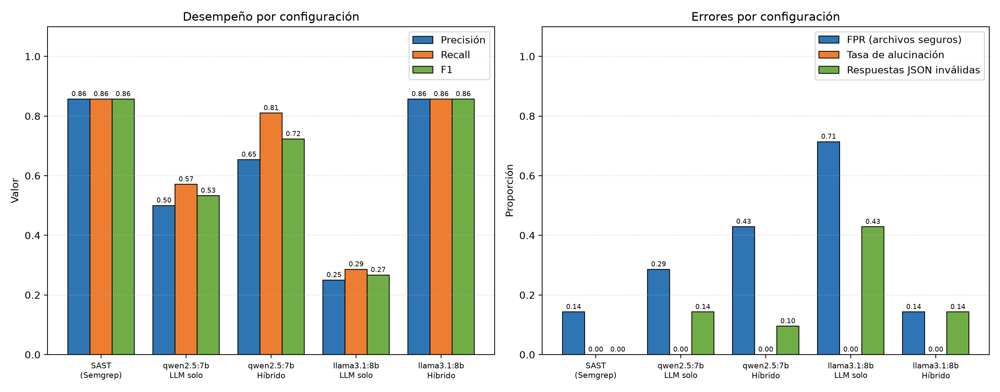

# SP-003 · Modelos LLM y Tool Use para análisis SAST

Spike de investigación técnica SP-003 de la épica EP-003 (Auditoría Automática de Seguridad y Vulnerabilidades), parte del proyecto *Sistema multiagente para auditoría de software* (Taller Integrador I).

## Objetivo

Comprobar en la práctica qué tan bien identifica vulnerabilidades estáticas un modelo de lenguaje con Tool Calling, y compararlo con un análisis SAST tradicional. Se miden tres cosas: precisión, alucinación y soporte de herramientas.

## Qué se probó

Se usaron 14 archivos Python (7 vulnerables y 7 seguros) con la respuesta correcta definida en `ground_truth.json`. Cada vulnerabilidad tiene su versión corregida, para medir también los falsos positivos. Cubre inyección SQL (CWE-89), inyección de comandos (CWE-78), secretos en el código (CWE-798), path traversal (CWE-22), deserialización insegura (CWE-502) y hash débil (CWE-327).

Hay dos casos pensados como trampa:

- `13_sqli_percent.py`: es vulnerable, pero las reglas de Semgrep no la detectan.
- `14_system_constant.py`: es segura, pero Semgrep la marca como peligrosa.

Se evaluaron tres configuraciones:

| Modo | Descripción |
|---|---|
| `sast` | Solo Semgrep con reglas propias (`rules.yml`). Es la línea base. |
| `llm` | El modelo recibe el código y responde sin usar herramientas. |
| `hybrid` | El modelo usa Tool Calling (`run_semgrep` y `read_file`) y hace el triaje de los hallazgos. |

Modelos (ambos locales, con Ollama): **qwen2.5:7b** (Modelo A) y **llama3.1:8b** (Modelo B). Cada configuración con LLM se corrió 3 veces con temperatura 0.

## Resultados

| Configuración | Precisión | Recall | F1 | FPR | Alucinación | Consistencia | JSON inválido | Latencia (s) |
|---|---|---|---|---|---|---|---|---|
| SAST (Semgrep) | 0.857 | 0.857 | 0.857 | 0.143 | 0.0 | 1.0 | 0 de 14 | 2.05 |
| Modelo A · LLM solo | 0.500 | 0.571 | 0.533 | 0.286 | 0.0 | 1.0 | 6 de 42 | 2.25 |
| Modelo A · Híbrido | 0.654 | 0.810 | 0.723 | 0.429 | 0.0 | 0.929 | 4 de 42 | 4.49 |
| Modelo B · LLM solo | 0.250 | 0.286 | 0.267 | 0.714 | 0.0 | 1.0 | 18 de 42 | 1.25 |
| Modelo B · Híbrido | 0.857 | 0.857 | 0.857 | 0.143 | 0.0 | 1.0 | 6 de 42 | 4.30 |



Lo más relevante:

- Ningún LLM solo superó a Semgrep. El mejor fue qwen2.5:7b con F1 de 0.533.
- Con Tool Calling, el recall mejoró frente al LLM solo en los dos modelos. Con llama3.1:8b el F1 pasó de 0.267 a 0.857, igual al de Semgrep.
- El modo híbrido detectó el caso 13, que Semgrep no ve.
- Tampoco corrigió todos los errores de Semgrep: el caso 14 siguió marcándose como vulnerable.
- No hubo alucinaciones en ninguna configuración. Los errores fueron de criterio (falsos positivos) y de formato.
- llama3.1:8b se negó a analizar el código en 6 de los 14 archivos (18 de 42 respuestas) y no devolvió JSON. El programa esas respuestas las cuenta como "sin hallazgos".

El detalle por archivo está en `results/tabla_por_archivo.csv`.

## Estructura

```
cases/                 14 archivos de prueba
ground_truth.json      respuesta correcta de cada archivo
rules.yml              reglas de Semgrep usadas como línea base
runner.py              ejecuta las pruebas y calcula las métricas
grafico.py             genera results/grafico_metricas.png
tabla_archivos.py      genera la tabla de resultados por archivo
ver_caso.py            muestra un caso individual de los transcripts
requirements.txt       dependencias
results/               evidencia de cada ejecución
```

Cada carpeta dentro de `results/` tiene `transcripts.jsonl` (respuesta cruda, hallazgos y llamadas a herramientas por archivo) y `metrics.json`. El resumen de todas las ejecuciones está en `results/summary.csv`. La carpeta de la línea base se llama `sast_anthropic_...` por un detalle de nombre en la primera versión del script; en ella no se usó ningún modelo.

## Cómo reproducirlo

Lo ejecuté en Windows con Python 3.14.8, Semgrep 1.179.0 y Ollama.

```powershell
python -m venv venv
venv\Scripts\Activate.ps1
python -m pip install -r requirements.txt
python -m pip install matplotlib

ollama pull qwen2.5:7b
ollama pull llama3.1:8b

python runner.py --mode sast
python runner.py --mode llm    --provider openai --base-url http://localhost:11434/v1 --model qwen2.5:7b --runs 3
python runner.py --mode hybrid --provider openai --base-url http://localhost:11434/v1 --model qwen2.5:7b --runs 3
python runner.py --mode llm    --provider openai --base-url http://localhost:11434/v1 --model llama3.1:8b --runs 3
python runner.py --mode hybrid --provider openai --base-url http://localhost:11434/v1 --model llama3.1:8b --runs 3

python grafico.py
python tabla_archivos.py
```

Semgrep no corre bien de forma nativa en Windows en todos los equipos; si falla la instalación, se puede usar WSL. El script también acepta `--provider anthropic`, pero no se usó en estas pruebas.

## Limitaciones

- Son solo 14 archivos sintéticos y de un único lenguaje, así que los resultados son indicativos y no concluyentes.
- Solo se probaron dos modelos pequeños de pesos abiertos (7B y 8B). No se evaluó ningún modelo propietario ni uno de mayor tamaño.
- Las reglas de Semgrep son propias y limitadas; con otro conjunto de reglas cambiaría la línea base.
- La temperatura 0 reduce la variabilidad, pero no la elimina.
- El caso `05_secret_hardcoded.py` contiene una clave falsa con formato de Stripe, creada para la prueba. GitHub la detectó al subir los resultados, ya que los modelos la repiten en sus respuestas. No es una credencial real.
